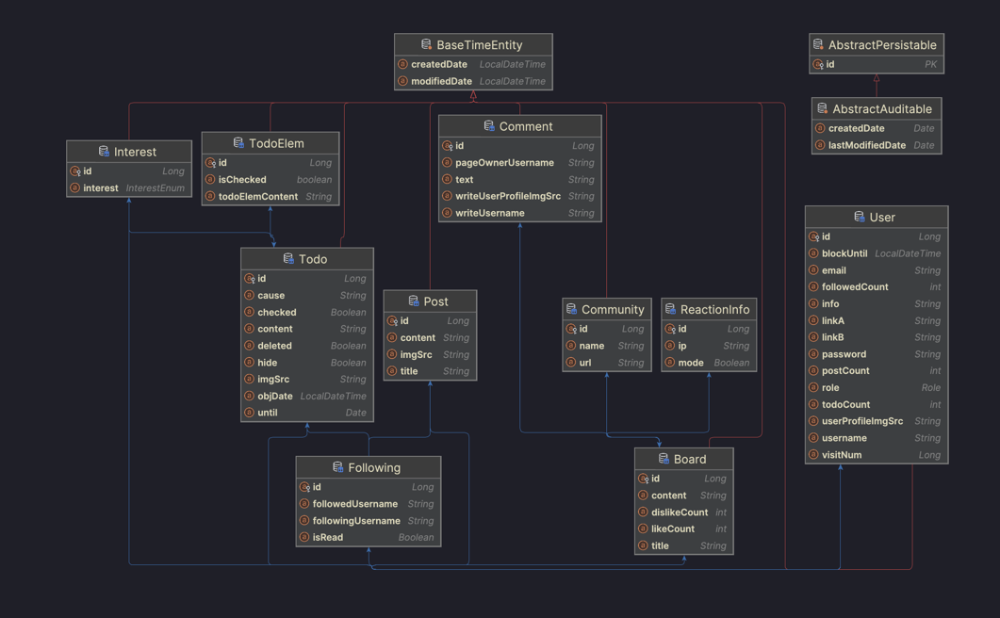
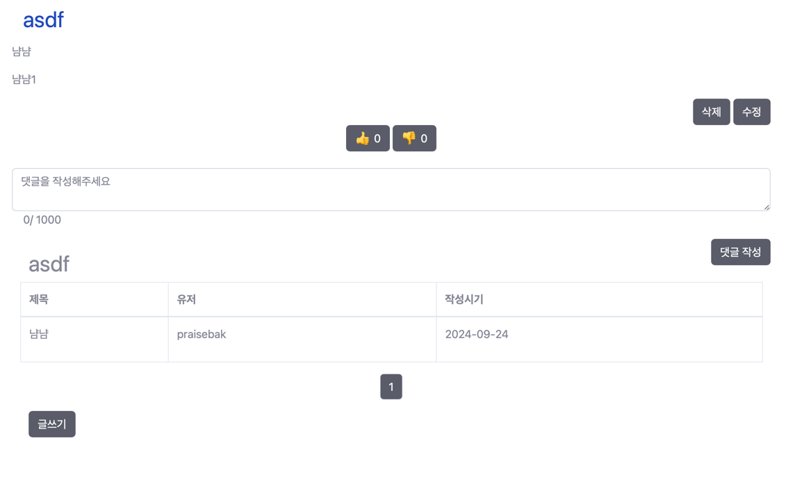

# ExpressDrive 🎨
ExpressDrive에서 자신의 발자취를 공유해보세요!

## 소요 기간 : 2달

## ERD

## 기술적 쟁점
- 통계와 같은 그래프는 템플릿으로 대체
  - 이미 만들어진 템플릿에 데이터를 적용할 수 있는가
- 기존에 학습한 방식을 응용하여 얼마나 빠르고 간결하게 구현할 수 있는가
- 디자인에 너무 신경을 쓰지 않기 위해 간결한 디자인으로 빠르게 구현

# 기능
- 기본 유저 기능
## TODO 관련
  - 목표와 카테고리 설정 및 날짜 지정
  - 이미지 삽입 및 gif, 이미지 리사이징
  - 성공 원인 작성
  - 다른사람들이 댓글을 작성할 수 있습니다
## 통계
  - 기간별로 성공한 Todo 확인 가능
  - 카테고리별로 확인 가능
  - 매일매일 성공한 Todo 컨트리뷰션에 기록

## 추천
  - 자신의 관심사와 비슷한 유저의 Todo 볼 수 있게 추천
  - 팔로우하여 팔로우 대상이 새로운 글을 작성하면 알람을 받을 수 있습니다
## 커뮤니티
  - 커뮤니티에서 관심사에 대해 이야기할 수 있습니다.
  
# 느낀점
- ResponseDto를 구현함으로써 통일성 있는 리턴이 가능해졌다.
- Validation과 지금까지 잘못사용하던 어노테이션을 바로잡음.
  - 간결한 코드와 빠른 속도의 구현가능!